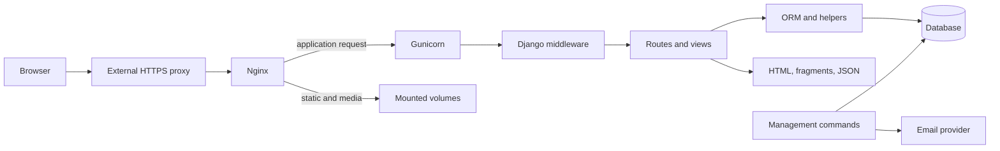

# Architecture

[Project overview](../../README.md)

nosCadeaux is a server-rendered Django application with one main domain app,
`gifts`. View modules divide the domain into accounts, groups, wishes, shared
lists, events, and a small Firefox API. It uses Django ORM models and migrations,
session authentication for browser pages, templates, and targeted JavaScript.

## Request flow

Local `runserver` replaces the proxy/Gunicorn chain. The browser pages are mostly
under language-prefixed routes such as `/fr/` and `/en/`. Extension routes and
`/i18n/` are registered outside `i18n_patterns`.

Authentication middleware populates `request.user`. `AccountSetupMiddleware`
then gates incomplete accounts using the central onboarding step definitions.
Views apply authentication, HTTP-method, and object-specific access checks before
reading or changing data.

## Module map

| Source | Responsibility |
| --- | --- |
| [config/](../../config/) | Settings, root routing, WSGI/ASGI entry points |
| [models.py](../../gifts/models.py) | Domain schema, selected invariants and model helpers |
| [account.py](../../gifts/account.py), [onboarding.py](../../gifts/onboarding.py) | Authentication and setup flow |
| [groups.py](../../gifts/groups.py) | Group routes and managed-person entry points |
| [group_invitation_flow.py](../../gifts/group_invitation_flow.py) | Preview, join, dismiss, and pending invitation handling |
| [group_invitations.py](../../gifts/group_invitations.py) | Invitation delivery and quota reservation |
| [views.py](../../gifts/views.py) | Dashboard, personal lists, reservations, comments, history, balances, subscriptions |
| [shared_lists.py](../../gifts/shared_lists.py) | Shared membership, publication, transfer, restore |
| [events.py](../../gifts/events.py) | Events, guest reservations, Secret Santa |
| [extension_api.py](../../gifts/extension_api.py) | Browser authorization and bearer API |
| [signals.py](../../gifts/signals.py) | Managed-user and abandoned-group cleanup |
| [management/commands/](../../gifts/management/commands/) | Scheduled work and operational commands |
| [templates/](../../gifts/templates/), [static/](../../gifts/static/) | HTML, email templates, browser assets |

## Persistence and background work

SQLite is the development default; Compose uses PostgreSQL. Uploaded media and
collected static files have separate volumes. Database backup alone does not
include uploaded images.

Email is sent synchronously by some request handlers and by management commands.
The scheduler is a shell loop running Django commands against the same database;
there is no separate task queue configured in this repository.

## Deeper references

- [Data model](data-model.md): relationships and lifecycle rules.
- [Access control](access-control.md): privacy boundaries and policy entry points.
- [Extension protocol](extension.md): product capture, authorization, API payloads.
- [External services](external-services.md): email, Turnstile, GitHub reports.

Use [Features](../features/README.md) for behavior, [Development](../development/README.md)
for running changes, and [Operations](../operations/README.md) for deployment.
