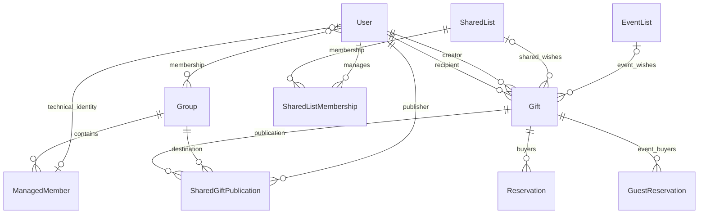

# Data model

[Architecture](README.md)

All application models live in [gifts/models.py](../../gifts/models.py).
This page identifies relationships and invariants; inspect the model and its
migrations for exact field definitions and indexes.

## Core relationships

The optional `ManagedMember.user` relation remains nullable in the schema for
historical compatibility. Current creation code always supplies a technical user.

## Identity and groups

| Model | Key facts |
| --- | --- |
| `User` | Extends `AbstractUser`; unique email is the login field; nickname, birthday month/day, avatar, verification/onboarding/demo state |
| `Group` | Many-to-many members; independent short code/private invitation token; creator uses `SET_NULL` |
| `ManagedMember` | Belongs to one group and links one technical user; stores display name and color |

An account's onboarding completion timestamp and version are constrained together.
The `User.save()` helper also fills completion timestamps for versioned accounts.
Bulk/queryset updates must preserve invariants themselves.

## Gifts and collaboration

| Model | Key facts |
| --- | --- |
| `Gift` | Required owner and creator; optional event/shared/managed relationships; visibility, tags, draft/hidden/offered state, costs |
| `GiftTag` | Supported tag slugs and translated display labels |
| `Reservation` | Buyer, gift, exclusivity, amount paid; reverse gift relation is named `reservation` |
| `GiftComment` | Gift and group context, author, text, edit/soft-delete metadata |
| `BalanceSettlement` | Group, payer, payee, amount |
| `SharedList` | Name, managing members, deletion time, restoration token, demo scope |
| `SharedListMembership` | Unique shared-list/user pair |
| `SharedGiftPublication` | Unique gift/group/publisher triple |

For personal wishes, `visible_in` defines group selection. Shared wishes use
publication rows instead. `Gift.owner` is a compatibility anchor for shared
wishes; functional ownership comes from `shared_list` and its memberships.
See [lists](../features/lists.md) before reusing a generic gift queryset.

## Events

`EventList` owns event gifts and stores access token, mode, date, budget, and
participants. `GuestReservation` supports either an authenticated user or a named
session identity. It has a conditional uniqueness constraint for gift/user pairs
when a user exists.

Secret Santa uses guest-participant, exclusion, and assignment records. Pair
records have separate user/guest foreign keys for each giver and receiver.
Application helpers normalize identities into `user:<id>` / `guest:<id>` keys.

## Delivery and credentials

| Model | Purpose and constraint |
| --- | --- |
| `Subscription` | Unique subscriber/owner pair, channel preferences, private RSS token |
| `NotificationDigestPreference` | One per user, frequency and last-send time |
| `ReminderDelivery` | Unique subscription/event/year delivery claim |
| `GroupInvitationDispatch` | Quota and delivery counts; no recipient addresses |
| `AuthThrottleEvent` | Action, HMAC of client IP, timestamp; composite lookup index |
| `OnboardingDailyCount` | Unique day/event aggregate; no user foreign key |
| `ExtensionAuthorizationCode` | Hashed one-time code, PKCE challenge, redirect URI, expiry/use timestamps |
| `ExtensionAccessToken` | Lookup prefix, token hash, last-use and revocation timestamps |

## Cascades and retention

Required gift owner/creator references use cascading deletion. Removing a shared
list or event also cascades to its linked gifts. Group deletion cascades to its
managed profiles, comments, publications, and settlements; reservation-group
references on gifts use `SET_NULL`.

[signals.py](../../gifts/signals.py) additionally removes inactive managed users
when their profiles disappear and prunes groups without real members after user
deletion. These effects are not captured by inspecting one foreign key alone.

Shared-list deletion first uses a soft-delete/restore flow, then a scheduled purge.
See [maintenance](../operations/maintenance.md) for retention and
[onboarding migration](../operations/onboarding-migration.md) for historical repairs.
